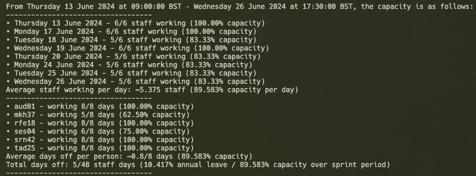

# Sprint Capacity Planner
The Sprint Capacity Planner is a tool created by [Scott Robinson](https://www.github.com/ScottRobinson03), that can be used to fetch and parse annual leave from a team's Confluence calendar in order to work out the team's capacity for a Sprint. The tool also takes into consideration bank holidays for England/Wales by using the official [gov.uk API](https://www.gov.uk/bank-holidays.json).

## Usage

### Environment Variables
Environment variables are retrieved from the [.env](./.env) file. Below is a table of the environment variables required by this tool:

| Name | Description |
| --- | --- |
| CONFLUENCE_PAT | Your Personal Access Token for your organisation's Confluence instance. For more info, see [the Confluence PAT docs](https://confluence.atlassian.com/enterprise/using-personal-access-tokens-1026032365.html) |
| CONFLUENCE_ROOT_DOMAIN | The root domain of your organisation's Confluence instance. E.g. `organisation.confluence.rootdomain`. This is the domain you go to for viewing your team's Confluence calendar. |
| CONFLUENCE_SPACE_KEY | Only used in [getAnnualLeaveSubCalendars.js](./getAnnualLeaveSubCalendars.js). The space key of your team's calendar. This may or may not be the same as your team name, and can be found by going to your team's Confluence calendar in the browser and looking at the full URL (there should be a `spaceKey` parameter).
| TEAM_NAME | The name of the team you want to fetch annual leave for. Note that the team must be in the [teams.json](./src/teams.json) file (see [Team Configuration](#team-configuration)) |

### Team Configuration
The team configuration is stored within the [teams.json](./src/teams.json) file.
Each team must have an array of `developers`, where the items match the confluence user id of the developer, and an `annualLeaveSubCalendarId` (see [below](#filter-all-calendars-to-just-annual-leave-calendars) for how to find this).

#### Find Team's Annual Leave Calendar
In order to find your team's annual leave calendar on Confluence, you'll need two pieces of information: your team's confluence space key, and your organisation's Confluence root domain.

Once you've found these two things, you can enter them into the [.env](./.env) file (as described [above](#environment-variables)) and run the [getAnnualLeaveSubCalendars.js](./getAnnualLeaveSubCalendars.js) script. There may be multiple annual leave calendars under a given space key, so the script returns an array of annual leave calendars from which you need to figure out your team's.
